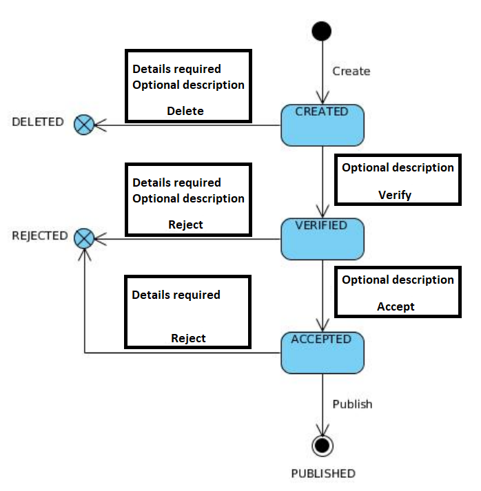

# Request Manager
## management of requests

## Introduction
Application is back-end REST service and provides few endpoints to manage requests

## Assumptions required
1) The state diagram describes the possible states of the application and the transitions between them
2) Possible states of request: CREATED, VERIFIED, ACCEPTED, DELETED, REJECTED, PUBLISHED 
3) When adding a new application, it is necessary to provide its name (title) and content (description)
4) The content of the application (description) may change only in the states 'CREATED' and 'VERIFIED'
5) Reasons (details) must be given when removing / rejecting an application
6) Complete history of changes to the application state is stored in the database
7) It is possible to view applications (default pagination 10 lines) along with
filtering by name (title) and status
8) At the time of publication of the document, it given a unique number
(numeric) UUID to the request
9) Created REST endpoints
10) Requests  are stored in the database

On the diagram:
1) Details required means that reasons (details) have to be attached with DELETE od REJECT operations
2) Optional description means that content of request may be modified during following operations: DELETE, REJECT verified request, VERIFY, ACCEPT
3) Request status flow have to follow the diagram flow
